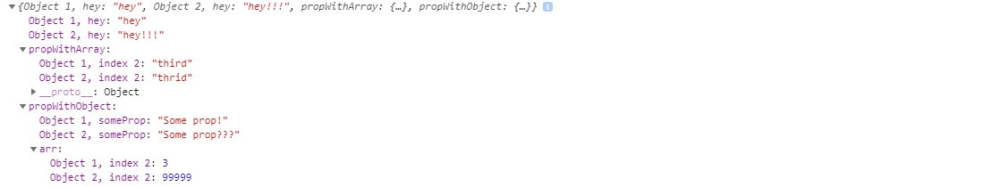

# whatIsDifferent()

Using `lodash.isEqual()` is great for deep comparison of two nested objects, but it only returns a boolean. It is sometimes useful in debugging to know exactly what is different.

If you have two object, for example:

```
const object1 = {
    hey: "hey",
    propWithArray: [ 'first', 'second', 'third' ],
    propWithObject: {
        id: 1,
        someProp: 'Some prop!',
        arr: [1, 2, 3, 4, 5]
    },
    noDifferenceProp: {
        value: 'No difference here :)'
    }
}

const object2 = {
    hey: "hey!!!",
    propWithArray: [ 'first', 'second', 'thrid' ],
    propWithObject: {
        id: 1,
        someProp: 'Some prop???',
        arr: [1, 2, 99999, 4, 5]
    },
    noDifferenceProp: {
        value: 'No difference here :)'
    }
}
```

Then `console.log(whatIsDifferent(object1, object2))` will show you:


